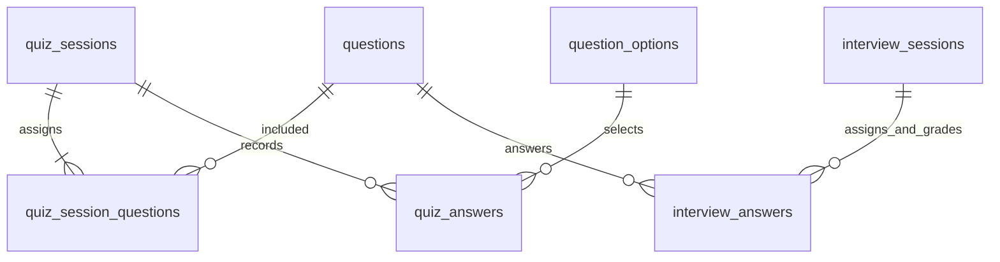

# ERD — Knowledge Gym (32 bảng PostgreSQL + 1 MVIEW + Redis)

> **ADR-002:** Single-tenant — **không** có bảng `tenants`. Multi-tenant/monetization = **deferred Phase 5+** (xem `02-monetization.md`).
> **Diagram:** `docs/07-erd.mmd` (compact) · `docs/07-erd.svg` · `docs/07-erd-preview.html`.
> **DDL (cook source of truth):** [`docs/07-erd-ddl.sql`](./07-erd-ddl.sql) — full `CREATE TABLE` V001–V013. File này = lookup + tiers + quy tắc.
> Migration m4 (`V014`, `V015`) chỉ `ALTER TABLE` / index / trigger — xem mục **V014–V015** bên dưới.
> Preview IDE: Command Palette → **Mermaid Viewer: Open Preview to the Side**.
> **Quy tắc:** mọi bảng **phải** thuộc đúng 1 migration. Enum **luôn UPPERCASE**. FK nullable ghi rõ.

## Quy tắc thiết kế (đọc trước khi implement)

| Quy tắc | Nội dung |
|---|---|
| **Enum casing** | **UPPERCASE** ở cả DB (CHECK constraint / VARCHAR) và Java enum. Không dùng lowercase trong docs. |
| **Naming FK** | Luôn có hậu tố `_id`: `used_in_post_id`, `source_module_id`, `deck_id`. |
| **Soft ref** | FK nullable + `ON DELETE SET NULL` cho tham chiếu không bắt buộc (`source_note_id`, `deck_id`). |
| **Counter cache** | `blog_posts.view_count` / `like_count` là **cache** — nguồn thật là `blog_views` / `blog_post_likes` (+ Redis buffer 5m). |
| **XP / streak** | **`study_attempts` là nguồn gốc** (append-only, ghi trong cùng tx nghiệp vụ từ m5/m6). `users.xp` + `user_progress` (mastery/total/correct) là **read model ghi cùng tx với attempt** và **recompute được** từ `study_attempts`; tính đúng-một-lần đến từ **luật "lần đầu của câu" + advisory lock** (m7 P5), **không** từ tx boundary. `user_progress.streak_days` **m7 không ghi** (streak tính on-read). Redis (`lb:global`) chỉ là cache TTL 1h — flush xong rebuild phải ra cùng kết quả. |
| **Attempt tables** | 3 bảng riêng có mục đích khác nhau — **không gộp**: `study_attempts` (flashcard/daily/practice), `quiz_answers` (trong quiz session), `interview_answers` (trong interview session). |
| **Search** | Elasticsearch 8 (index `knowledge-gym-search`) là chính cho `GET /search`; `search_vector tsvector + GIN` trên `questions`/`notes`/`blog_posts` là fallback tự động khi ES lỗi/tắt (xem V023 + `GlobalSearchUseCase`). |
| **Tags** | `TEXT[] + GIN index`. **Không** dùng junction table `question_tags`. |
| **Reserved enum** | `users.role` có `PREMIUM`, `users.auth_provider` có `GITHUB` — khai báo sẵn trong CHECK, **chưa dùng** ở MVP. |
| **OAuth columns** | `auth_provider` (`LOCAL`/`GOOGLE`/`GITHUB`) + `oauth_id` (NULL khi LOCAL). **Không** có cột `oauth_provider` (trùng nghĩa). UK partial: `(auth_provider, oauth_id) WHERE oauth_id IS NOT NULL`. |

## Bảng tra cứu — 33 bảng × migration (32 từ m2 + 1 từ m6)

### Identity (6 bảng)

| Bảng | Migration | PK / UK | Ghi chú |
|---|---|---|---|
| `users` | **V001** | `id PK`, `email UK`, `UK (auth_provider, oauth_id)` partial | `password_hash` NULL khi OAuth-only. `auth_provider` + `oauth_id` (không có `oauth_provider`). `xp INT` = read model ghi **cùng tx** với attempt (m7) + recompute được từ `study_attempts` (`idx_users_xp` cho leaderboard). **Không có** cột `level`; `longest_streak` cũng không có — cả hai hoãn m12. |
| `refresh_tokens` | **V001** | `id PK`, `token_hash UK` | Audit log 2 lớp (Redis lookup + PG audit). `expires_at` TTL 7d |
| `notification_preferences` | **V001** | `id PK`, `UK (user_id, channel)` | 1 user nhiều channel (EMAIL + PUSH) |
| `audit_logs` | **V008** | `id PK` | `details JSONB` |
| `user_badges` | **V008** | `PK (user_id, badge_code)` | `badge_code` ENUM, không cần bảng lookup. Gamification = m12, de-scopable |
| `password_reset_codes` | **V011** | `id PK` | Mã 6 ký tự, `code_hash` SHA-256, TTL 10m, max 5 attempts |

### Content (4 bảng)

| Bảng | Migration | PK / UK | Ghi chú |
|---|---|---|---|
| `topics` | **V002** | `id PK`, `slug UK` | `display_order INT` thêm ở **V014** (giữ thứ tự topic theo `nav-group` của `index.html`) |
| `modules` | **V002** | `id PK`, `slug UK` | FK → `topics` |
| `questions` | **V003** | `id PK`, **V014** `UK (module_id, sort_order)` | `tags TEXT[] + GIN`, `search_vector tsvector + GIN` (ES fallback), `hints JSONB` nullable, `version INT` cho `@Version`. **V014** thêm `uk_questions_module_sort` = natural key cho upsert idempotent. **V015** thêm `searchable_text TEXT` + trigger `trg_questions_search` populate `search_vector`; **V023** thêm trigger `trg_search_outbox_question` đẩy thay đổi vào `search_outbox` cho ES index |
| `question_options` | **V003** | `id PK` | FK → `questions`, multiple-choice |

### Learning (14 bảng)

| Bảng | Migration | PK / UK | Ghi chú |
|---|---|---|---|
| `srs_decks` | **V004** | `id PK` | `module_id` NULL = custom deck do user tạo (`01-ux-modes.md` L42–43) |
| `srs_cards` | **V004** | `id PK`, `UK (user_id, question_id)` | `deck_id` NULL, `source_note_id` NULL (note→card), SM-2 fields |
| `study_attempts` | **V004** | `id PK` | `source (FLASHCARD/DAILY/PRACTICE)` — phân biệt nguồn attempt. **Nguồn gốc của mọi số liệu dashboard**: m7 ghi `users.xp`/`user_progress` cùng tx và có công thức để recompute từ đây. Index `idx_attempts_user_date (user_id, attempted_at DESC)` + `idx_attempts_wrong` ngay trong V004 — **V009 không tạo index nào** (placeholder). Attempt ghi bởi `ReviewCardUseCase` (FLASHCARD) và `SubmitQuizUseCase` (PRACTICE); **mock interview không ghi attempt** (CHECK không có giá trị `INTERVIEW`) |
| `user_progress` | **V004** | `id PK`, `UK (user_id, module_id)` | UPSERT conflict target. `streak_days` per-module; `mastery_pct` = `correct_count / total_attempts`, `total_attempts = 0` ⇒ `0`. Là **read model** của `study_attempts` — ghi cùng tx với attempt (m7), gộp theo module (1 quiz = 1 upsert), **không** dùng `save()` (UK `23505` khi 2 module concurrency) |

| `challenges` | **V012** | `id PK`, `slug UK` | Code sandbox — **khác** `questions`. `hints JSONB`, `solution_code` |
| `challenge_test_cases` | **V012** | `id PK` | FK → `challenges`, `is_hidden` cho hidden test |
| `code_submissions` | **V012** | `id PK` | FK → **`challenges`** (không phải `questions`), `viewed_solution_at` |
| `quiz_sessions` | **V013** | `id PK` | `strategy (RANDOM/WEAKNESS/INTERVIEW/SPACED)` |
| `quiz_session_questions` | **V016** | `PK (session_id, question_id)` | Ordered membership, cả 2 FK CASCADE |
| `quiz_answers` | **V013**, **V016** | `id PK`, `UK (session_id, question_id)` | `selected_option_id` FK NULL (`ON DELETE SET NULL`) + `answer_text` = snapshot nội dung option đã chọn, giữ được lựa chọn của user khi option bị sinh lại |
| `interview_sessions` | **V013** | `id PK` | `mode (TEXT/AUDIO)`, `status (ACTIVE/FINISHED)`, `overall_score` |
| `interview_answers` | **V013**, **V016**, **V017** | `id PK`, `UK (session_id, question_id)`, `display_order NOT NULL` | Hai vai trò trên cùng bảng: placeholder membership (`keyword_score NULL`, `display_order` = thứ tự giao câu) và row kết quả sau khi chấm. `audio_url` cho speech mode |
| `notifications` | **V013** | `id PK` | `metadata JSONB` chứa entity refs (vd. `questionId`) |
| `daily_challenge_assignments` | **V013** | `id PK`, `UK (user_id, challenge_date)` | `status (PENDING/COMPLETED/SKIPPED)` — nút "Skip hôm nay" |

### Notes (1 bảng)

| Bảng | Migration | PK / UK | Ghi chú |
|---|---|---|---|
| `notes` | **V005** | `id PK` | `note_type (QUICK/STUDY/HIGHLIGHT/BOOKMARK)` — bookmark = note row. `search_vector` ES fallback |

### Blog Agent (8 bảng)

| Bảng | Migration | PK / UK | Ghi chú |
|---|---|---|---|
| `blog_posts` | **V006** | `id PK`, `slug UK` | `author_id` NULL khi AI viết. `source_module_id` / `source_question_id` / `source_note_id` đều nullable |
| `blog_comments` | **V006** | `id PK` | `parent_id` NULL cho replies (self-FK) |
| `blog_views` | **V006** | `id PK`, `UK (post_id, user_id)` | Idempotent view tracking |
| `blog_post_likes` | **V006** | `id PK`, `UK (post_id, user_id)` | Like/unlike idempotent — `like_count` chỉ là cache |
| `collector_sources` | **V007** | `id PK` | `fetch_interval_sec INT`, `config JSONB` |
| `collected_items` | **V007** | `id PK`, `url UK` | `content_hash` dedup, `used_in_post_id` FK NULL |
| `blog_generation_queue` | **V007** | `id PK` | `selection_strategy` (chọn topic) **tách khỏi** `writer_strategy` (cách viết) |
| `agent_runs` | **V007** | `id PK` | `queue_id` FK NULL. `tokens_used` / `cost_usd` **chỉ ở đây** (không duplicate trên queue) |

## Flyway Migrations — mọi bảng có đúng 1 migration

```
V001__create_users.sql               users, refresh_tokens, notification_preferences        (3)
V002__create_topics_modules.sql      topics, modules                                        (2)
V003__create_questions.sql           questions, question_options                            (2)
V004__create_srs_progress.sql        srs_decks, srs_cards, study_attempts, user_progress    (4)
V005__create_notes.sql               notes                                                  (1)
V006__create_blog.sql                blog_posts, blog_comments, blog_views,
                                     blog_post_likes                                        (4)
V007__create_agent.sql               collector_sources, collected_items,
                                     blog_generation_queue, agent_runs                      (4)
V008__create_audit.sql               audit_logs, user_badges                                (2)
V009__create_indexes.sql             placeholder (không tạo index/bảng — giữ migration sequence) (0)
V010__create_mviews.sql              user_topic_mastery MATERIALIZED VIEW                    (0)
V011__password_reset_codes.sql       password_reset_codes                                   (1)
V012__create_challenges.sql          challenges, challenge_test_cases, code_submissions     (3)
V013__create_quiz_interview.sql      quiz_sessions, quiz_answers, interview_sessions,
                                     interview_answers, notifications,
                                     daily_challenge_assignments                            (6)
V014__content_import_support.sql     topics.display_order + UK questions(module_id, sort_order) (0)
V015__questions_fulltext_search.sql  questions.searchable_text + tsvector trigger + GIN     (0)
V016__quiz_interview_integrity.sql   quiz_session_questions + UK/index quiz/interview       (1)
V017__interview_answer_order.sql     interview_answers.display_order                        (0)
V018__backfill_progress_read_models.sql  backfill users.xp + user_progress from study_attempts (0)
                                                                            ────────────────────
                                                                            TOTAL:        33 bảng
```

**Kiểm tra:** 3+2+2+4+1+4+4+2+0+0+1+3+6+0+0+1 = **33** ✓ — không bảng nào thiếu migration, không migration nào trùng số.

> **V014–V015 (m4), V017 (m6c) và V018 (m7)** không tạo bảng mới — chỉ V016 thêm bảng thứ 33.
>
> Các mục dưới đây nhóm theo phase ghi chú, không theo số version: V016/V017 (m6) trước, rồi V010
> (rà soát lại ở m7 — xem "V010 chưa được dùng"), rồi V014/V015 (m4).

### V016 — Quiz/interview integrity (m6)

Thêm bảng thứ 33: `quiz_session_questions(session_id, question_id, display_order)`.
PK `(session_id, question_id)`, FK session CASCADE và question CASCADE; index question_id.

UK `(session_id, question_id)` cho `quiz_answers` và `interview_answers`; index history
`quiz_sessions(user_id, started_at DESC)`, `interview_sessions(user_id, started_at DESC)`,
`interview_sessions(user_id, status)` và `quiz_answers(session_id)`.

### V017 — Thứ tự câu phỏng vấn (m6c)

`interview_answers.display_order INT NOT NULL` + index `(session_id)`: placeholder giao câu được
insert trong cùng transaction nên `attempted_at` bằng nhau — không có cột này thì `ORDER BY
attempted_at, id` trả về thứ tự UUID ngẫu nhiên thay vì thứ tự đã giao.
Flyway hiện có 18 migration / 33 bảng. V018 là data backfill, không đổi schema.

`interview_answers` mang vai trò kép: placeholder membership (`keyword_score` NULL, `display_order`
theo thứ tự giao) và row kết quả sau khi chấm. `answer()` upsert nội dung chấm, **không** đụng
`display_order`; xoá câu thì xoá row, session giữ nguyên.



Quiz membership tách riêng khỏi answers. Interview membership tái dùng answer placeholder
(`keyword_score=NULL`), grading upsert row đó; finish bỏ qua placeholder chưa nộp.
Xoá câu qua QuestionDependentsDao xoá quiz session liên quan và interview answer, giữ interview session.

### V010 — `user_topic_mastery` MVIEW **chưa được dùng** (m7 KHÔNG đọc)

`V010__create_mviews.sql` tạo MVIEW aggregate `user_progress` theo topic, nhưng **không có chỗ nào
trong repo gọi `REFRESH MATERIALIZED VIEW`** (chỉ `FlywayDatabaseMigrationTest` assert nó tồn tại).
Postgres không tự refresh ⇒ MVIEW trả snapshot tại thời điểm migrate, tức gần như luôn rỗng/sai.

**Quyết định m7:** radar/mastery tính trực tiếp từ `user_progress` (`GROUP BY module_id`, chỉ vài
chục row/user) — **không** đọc MVIEW. MVIEW để nguyên (không drop: migration đã ship, drop = thêm
nhiễu Flyway) và chỉ hồi sinh nếu m12 cần, lúc đó phải kèm `REFRESH ... CONCURRENTLY` định kỳ
(`idx_utm_user_topic` là unique index nên `CONCURRENTLY` dùng được).
### V014 — Content import support (m4)

```sql
ALTER TABLE topics ADD COLUMN display_order INT NOT NULL DEFAULT 0;

-- Natural key cho upsert idempotent: sort_order = số thứ tự .qa-card trong file module.
-- Không dùng title làm key vì title có thể trùng giữa các module.
CREATE UNIQUE INDEX uk_questions_module_sort ON questions (module_id, sort_order);
```

`(module_id, sort_order)` là conflict target của `INSERT ... ON CONFLICT ... DO UPDATE` (re-import `docs/`
không nhân đôi câu hỏi). Admin tạo/sửa câu hỏi trùng `sortOrder` trong cùng module → **409**. Import
cố ý **không** ghi đè `difficulty` (admin có thể đã sửa tay).

### V015 — Full-text search cho questions (m4)

```sql
ALTER TABLE questions ADD COLUMN searchable_text TEXT NOT NULL DEFAULT '';

CREATE OR REPLACE FUNCTION questions_search_vector_update() RETURNS trigger AS $$
BEGIN
    NEW.search_vector := to_tsvector('simple',
        coalesce(NEW.title, '') || ' ' ||
        coalesce(NEW.answer_html, '') || ' ' ||
        coalesce(NEW.searchable_text, ''));
    RETURN NEW;
END;
$$ LANGUAGE plpgsql;

DROP TRIGGER IF EXISTS trg_questions_search ON questions;
CREATE TRIGGER trg_questions_search
    BEFORE INSERT OR UPDATE OF title, answer_html, searchable_text ON questions
    FOR EACH ROW EXECUTE FUNCTION questions_search_vector_update();
```

`search_vector TSVECTOR + GIN` đã có từ V003 nhưng **chưa bao giờ được populate** → V015 làm nó hoạt
động thật bằng trigger. Trigger là **đường ghi duy nhất** cho `search_vector` (fire cả INSERT và
`UPDATE OF title, answer_html, searchable_text`), nên không có đường ghi lệch.

- `searchable_text` = token do `SearchText.build(title, answerText, tags)` sinh ra: bỏ dấu tiếng Việt,
  n-gram 2–3 từ (`bat-dong-bo`), tách slug gạch nối, và bảng synonym Việt–Anh (`sao-luu` ⟷ `backup`/`replication`,
  `bo-nho` ⟷ `memory`/`heap`, `garbage` ⟷ `thu-hoi-rac`). Ngân sách token cap 140.
- Config `simple` (chỉ lowercase + tokenize), **không** stemming: nội dung trộn tiếng Việt + tiếng Anh,
  stemming tiếng Anh sẽ băm nát từ tiếng Việt.

## Index chính (inline V001–V008, V013)

```sql
-- Auth
CREATE INDEX idx_refresh_tokens_user     ON refresh_tokens(user_id) WHERE revoked_at IS NULL;
CREATE UNIQUE INDEX idx_users_oauth      ON users(auth_provider, oauth_id)
                                         WHERE oauth_id IS NOT NULL;
-- SRS (query nóng nhất: "cards due today")
CREATE INDEX idx_srs_due                 ON srs_cards(user_id, next_review);
-- Dashboard heatmap + weakness radar
CREATE INDEX idx_attempts_user_date      ON study_attempts(user_id, attempted_at DESC);  -- V004
CREATE INDEX idx_attempts_wrong          ON study_attempts(question_id)               -- V004
                                         WHERE is_correct = false;
-- Leaderboard
CREATE INDEX idx_users_xp                ON users(xp DESC);
-- Notifications
CREATE INDEX idx_notif_unread            ON notifications(user_id, created_at DESC)
                                         WHERE read = false;
-- Daily challenge lookup
CREATE INDEX idx_daily_user_date         ON daily_challenge_assignments(user_id, challenge_date DESC);
-- Search (questions dùng FTS thật từ V015) + tags
CREATE INDEX idx_questions_search        ON questions USING GIN(search_vector);   -- V003, populate bởi V015
CREATE INDEX idx_notes_search            ON notes USING GIN(search_vector);       -- created V005; ES fallback
CREATE INDEX idx_questions_tags          ON questions USING GIN(tags);
-- Natural key import (V014)
CREATE UNIQUE INDEX uk_questions_module_sort ON questions (module_id, sort_order);
-- Blog
CREATE INDEX idx_blog_published          ON blog_posts(published_at DESC)
                                         WHERE status = 'PUBLISHED';
```

## Redis — cache layer (không phải bảng PostgreSQL)

```
┌─ Redis 7 — Knowledge Gym Key Space ────────────────────────────────────┐
│  AUTH (m03)           │  CACHE (m04) — Caffeine │  RATE LIMIT (m03)    │
│  rt:{hash}     → 7d   │  (L1 in-JVM, KHÔNG ở   │  rl:login:{ip}       │
│  rt:blacklist:{hash}  │   Redis; Redis L2 =    │  rl:register:{ip}    │
│                → 7d   │   scale-out tương lai) │  rl:forgot:{ip}      │
│  rt:revoked:{fid}→7d  │                        │  rl:global:{ip}      │
│  pwd_reset:{email}→10m│                        │                      │
│───────────────────────┼────────────────────────┼───────────────────────│
│  LEADERBOARD (m07)    │  STREAK (m07)          │  AI QUOTA (m10)      │
│  lb:global        1h  │  (KHÔNG cache ở m7:    │  ai:{uid}:{date}    │
│  lb:global:tmp:   60s │   streak tính on-read  │    → 48h            │
│    {uuid} mỗi lần     │   từ study_attempts)   │                      │
│  ↑ cache của users.xp │  key streak:{uid}:*    │                      │
│    (read model, ghi   │  chỉ là phương án nếu  │                      │
│     cùng tx + recompute│  sau này đo thấy chậm │                      │
│───────────────────────┼────────────────────────┼───────────────────────│
│  BLOG (m09)           │  LOCKS (m06,m10)       │  ONLINE (m12)        │
│  views:{pid}   → 5m   │  lock:quiz:{sid}:{uid} │  online:{uid} → 5m  │
│  likes:{pid}   → 5m   │  lock:ai:writer → 120s │  online:count (HLL) │
│  ↑ buffer, flush 5m   │                        │                      │
│   → blog_views /       │                        │                      │
│     blog_post_likes    │                        │                      │
└────────────────────────────────────────────────────────────────────────┘

Estimated memory (1000 users): ~0.5 MB  ← content cache ở m4a là Caffeine in-JVM (không tính Redis)
```

**Refresh token = 2 lớp:**
- **Redis** (`rt:{hash}`) — lookup O(1) khi refresh, TTL tự hết hạn
- **PostgreSQL** (`refresh_tokens`) — audit log + reuse detection family (không mất khi Redis restart)

## MVP schema vs Full schema

> **Flyway vẫn tạo đủ 32 bảng ở mini-phase 2** (tránh migration lẻ về sau + `ddl-auto=validate` ổn định).
> Bảng dưới phân theo **feature nào được phép dùng / ship** — không phải “tạo bảng sau”.

| Tier | Mini-phases | # bảng | Ý nghĩa |
|---|---|---|---|
| **MVP Must** | m1–m7 | **16** | App usable: auth + content + SRS + quiz/interview + dashboard |
| **MVP Optional** | m6 (de-scope ladder #2) | **3** | Code sandbox — có bảng sẵn, feature có thể defer |
| **Full** | m8–m12 | **13** | Notes, blog agent, daily challenge, audit/badges |
| **Deferred Phase 5+** | — | **~9** | Monetization / multi-tenant — **không** nằm trong 32 |

### MVP Must (16) — m1–m7

| Context | Bảng | Phase dùng |
|---|---|---|
| Identity | `users`, `refresh_tokens`, `password_reset_codes`, `notification_preferences` | m3 |
| Content | `topics`, `modules`, `questions`, `question_options` | m4 |
| Learning | `srs_decks`, `srs_cards`, `study_attempts`, `user_progress` | m5, m7 |
| Learning | `quiz_sessions`, `quiz_answers`, `interview_sessions`, `interview_answers` | m6 |

### MVP Optional / de-scopeable (3) — m6

| Bảng | Ghi chú |
|---|---|
| `challenges`, `challenge_test_cases`, `code_submissions` | Code sandbox Docker — cắt theo de-scope ladder #2 nếu trễ |

### Full (13) — m8–m12

| Context | Bảng | Phase dùng |
|---|---|---|
| Notes | `notes` | m8 |
| Blog | `blog_posts`, `blog_comments`, `blog_views`, `blog_post_likes` | m9 |
| Agent | `collector_sources`, `collected_items`, `blog_generation_queue`, `agent_runs` | m9–m10 |
| Polish | `notifications`, `daily_challenge_assignments` | m12 |
| Polish | `audit_logs`, `user_badges` | m12 (badges = de-scope ladder #4) |

**Kiểm tra:** 16 + 3 + 13 = **32** ✓

### Quy tắc ship

1. **m7 xong = MVP ship được** dù Full tables trống (0 rows), không wire API.
2. De-scope ladder cắt **feature/code**, không drop bảng đã migrate (tránh Flyway chaos).
3. **m7 không thêm bảng và không thêm cột.** `users.xp` + `user_progress.*` đã có từ V001/V004 ở dạng
   skeleton — m7 chỉ wire ghi/đọc (`users.xp`, `user_progress`) + công thức recompute. Nếu implement
   thực sự cần index mới (đo thấy chậm), đó là
   V018 và phải ghi lại trong journal: "chỉ thêm khi có số đo, không thêm phòng trước".
4. MVIEW `user_topic_mastery` (V010) **không** là datasource của m7 (chưa bao giờ refresh — xem
   mục V010 ở trên).

## Deferred Phase 5+ — KHÔNG có trong 32 bảng

Các feature trong `02-monetization.md` **cố tình không** đưa vào ERD (ADR-002):

| Feature | Bảng sẽ cần (Phase 5+) | Lý do defer |
|---|---|---|
| Multi-tenant / white-label | `tenants`, `tenant_settings`, `tenant_id` trên mọi bảng | ADR-002: single-tenant. Thêm sau = migration lớn nhưng chấp nhận được |
| Subscription / billing | `subscription_plans`, `user_subscriptions`, `payments` | Chưa monetize. `users.role` đã reserve `PREMIUM` |
| Content packs marketplace | `content_packs`, `content_pack_topics`, `user_pack_purchases` | Chưa bán content |
| Team / B2B license | `teams`, `team_members` | Chưa có khách B2B |

**Quyết định:** Full product = **32 bảng**. Monetization ~9 bảng = Phase 5+, không nhét vào MVP/Full hiện tại.

## Changelog

### 09/2026 — Rà soát toàn diện (18 → 29 → 32 bảng)

**Lỗi nghiêm trọng đã sửa:**

| # | Vấn đề | Sửa |
|---|---|---|
| 1 | **`quiz_sessions`, `quiz_answers`, `notifications` không thuộc migration nào** — schema sẽ fail `ddl-auto=validate` | Tạo **V013** chứa 6 bảng |
| 2 | `code_submissions.question_id` FK sai — code challenge ≠ question | Sửa → `challenge_id FK (challenges)` |
| 3 | Thiếu `challenges` + `challenge_test_cases` — API `/challenges/{id}` không có bảng | Thêm 2 bảng (V012) |
| 4 | `interview_sessions` gộp cả answer — API là 1 session → N answers | Tách `interview_answers` (V013) |
| 5 | API `POST /blog/posts/{id}/like` nhưng chỉ có `like_count` — không unlike/idempotent được | Thêm `blog_post_likes` UK (post_id, user_id) |
| 6 | Daily Challenge có nút "Skip hôm nay" nhưng không lưu state | Thêm `daily_challenge_assignments` UK (user_id, challenge_date) |
| 7 | "Custom deck" (`01-ux-modes.md`) không có bảng | Thêm `srs_decks` + `srs_cards.deck_id` nullable |
| 8 | `notification_preferences` UK `user_id` — chặn user có nhiều channel | Sửa → `UK (user_id, channel)` |
| 9 | `blog_views` thiếu PK, không idempotent | Thêm `id PK` + `UK (post_id, user_id)` |
| 10 | `user_progress` thiếu UK → UPSERT không có conflict target | Thêm `UK (user_id, module_id)` |
| 11 | `srs_cards` thiếu UK → user có thể có 2 card cùng question | Thêm `UK (user_id, question_id)` |
| 12 | `user_badges` không có PK | Thêm `PK (user_id, badge_code)` |
| 13 | XP chỉ ở Redis (m07) → mất khi restart | XP có **cột `users.xp` ghi cùng tx** với attempt + công thức tường minh (`UserXpPolicy`) để recompute từ `study_attempts`. Tính đúng-một-lần đến từ **luật "lần đầu của câu" + advisory lock** (m7 P5), **không** từ tx boundary; Redis chỉ là cache TTL 1h |
| 14 | `blog_generation_queue.strategy` mang 2 nghĩa (chọn topic vs cách viết) | Tách `selection_strategy` + `writer_strategy` |
| 15 | `tokens_used`/`cost_usd` duplicate ở queue và `agent_runs` | Chỉ giữ ở `agent_runs` + thêm `queue_id` FK |
| 16 | Note → flashcard / note → blog không truy vết được | Thêm `srs_cards.source_note_id`, `blog_posts.source_note_id` |
| 17 | ES fallback dùng `tsvector` nhưng không có column | Thêm `search_vector tsvector + GIN` |
| 18 | Enum lowercase/UPPERCASE lẫn lộn giữa docs và ERD | Chuẩn hóa **UPPERCASE** toàn bộ |
| 19 | `fetch_interval` vs `fetch_interval_sec`, `used_in_post` vs `used_in_post_id`, `source_topic` vs `source_module_id` | Chuẩn hóa hậu tố `_id` + đơn vị |
| 20 | `study_attempts` không phân biệt nguồn (flashcard/daily/practice) | Thêm `source` enum |

**Bảng mới (3):** `srs_decks`, `daily_challenge_assignments`, `blog_post_likes`
**Migration mới:** `V013__create_quiz_interview.sql` (6 bảng), `V012` đổi tên → `create_challenges` (3 bảng)

### 09/2026 — m4a: content import + full-text search (V014, V015)

| Migration | Nội dung | Bảng mới |
|---|---|---|
| **V014** `content_import_support.sql` | `topics.display_order`; **UK** `uk_questions_module_sort (module_id, sort_order)` = natural key cho upsert idempotent | 0 |
| **V015** `questions_fulltext_search.sql` | `questions.searchable_text TEXT`; function + trigger `trg_questions_search` populate `search_vector` (config `simple`); GIN `idx_questions_search` (đã có từ V003) giờ mới hoạt động thật | 0 |

Không tạo bảng mới → tổng vẫn **32 bảng**.
